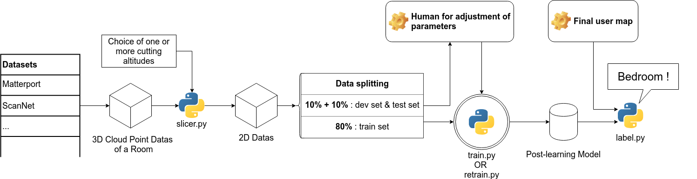
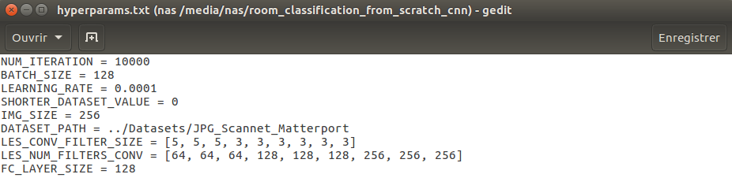
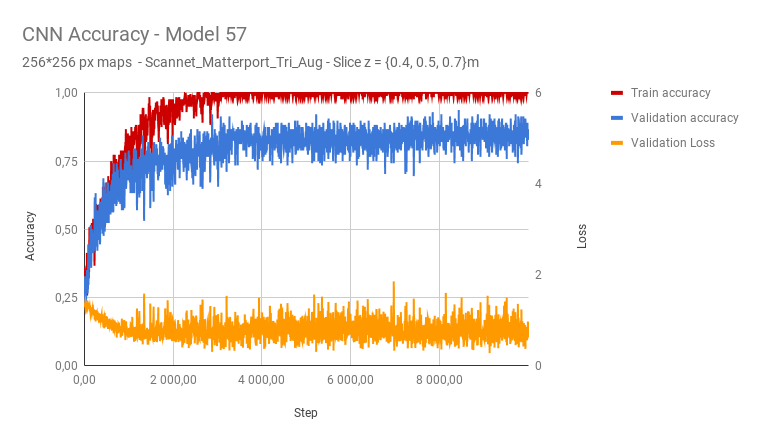

#room_classification_from_scratch_cnn
Project by [Paul Asquin](https://www.linkedin.com/in/paulasquin/) for Awabot - Summer 2018 paul.asquin@gmail.com  

# I.Introduction  
This repo is a part of the Room Classification Project. 
The aim of the Room Classification Project is to make an indoor mobile robot able to recognize a room using its 2D map. 
The output of the project should be "Kitchen", "Bedroom", "Bathroom", etc.  

In order to achieve this goal, we have chosen to use Machine Learning techniques in order to obtain a powerful recognition system with no hard-coded rules.  

As for every Machine Learning project, we need adapted datasets and a learning algorithm.  

Here is the overall architecture of the project :   
.  
├── room_classification_get_datasets  
├── room_classification_from_scratch_cnn  
├── room_classification_network_retrain  
├── Datasets (created by room_classification_get_datasets)   
  
  
_Room Classification Project Architecture_  

Before coming to this repo, you should have installed the project datasets using _room\_classification\_get\_datasets_

# II. Goals and instructions
The goal of this repo is to build and train a Convolutional Neural Network in order to generate a model for the room classification [train.py](train.py), and use this model to make prediction on new given maps [predict.py](predict.py).
Those scripts are inspired by the work of the [cv-tricks](http://cv-tricks.com/) website who developed the most reachable tutorial that I found on [Image CNN training](http://cv-tricks.com/tensorflow-tutorial/training-convolutional-neural-network-for-image-classification/).
In order to learn more about CNN operation, you can consult [this page](https://medium.com/@RaghavPrabhu/understanding-of-convolutional-neural-network-cnn-deep-learning-99760835f148) from [medium.com](https://medium.com).  

## 1. Build a network
For this code to build your own CNN model, you have to choose the hyperparameters that will define the model. 
For this, you will have to edit the file [hyperparams.txt](hyperparams.txt).  

  

Here are the influences of each parameter change : 

**NUM_ITERATION**: number of training iterations.  
\+ If too tall, the model still works but in the end will not learn anymore and performs unnecessary calculations  
\- If it is too small, the model does not have time to reach its actual performance  

**BATCH_SIZE**: The size of the image subpacket used for each train iteration.  
\+ If too large, the necessary calculations and memory explode and the performance of the model decreases by loss of the generalization capacity.  
\- If too small, gradient descents are less representative and performance calculations become noisy.  

**LEARNING_RATE**: learning speed, speed coefficient of the gradient descent.  
\+ If too large, the gradient descent can lead to a divergence.  
\- If too low greatly slows the speed of calculation.  

**SHORTER_DATASET_VALUE** optional: limit the number of images per categories.  
\+ If the number of files used is too large, the demand in memory and calculation explodes.  
\- If this number is too low, the model is lacking data to learn in a representative way.  

**IMG_SIZE**: size in pixels of images, with a native maximum of 500px.  
\+ If too big, the resolution of the images explodes the request in memory and calculation. Similarly, this feature may not be representative of the user application.  
\- If too small, the resolution of the images no longer makes it possible to identify features on the cards.  

**DATASET_PATH**: used data set, for example ScanNet, ScanNet_Aug, ScanNet_Matterport_Tri_Aug ...  
\+ If the dataset is too big or not specific enough, the model will not be able to learn from its features in a reasonable amount of time.  
\- If the dataset is too small or its data too specific, the model will overfit to this dataset.  
~ If the dataset contains too many errors, the results may become meaningless.  

**LES_CONV_FILTER_SIZE**: list of the size of the convolution filters, that is to say size of the local area to study. See Figures 4 & 5 of medium.com  
\+ If values are too large or if the list is too big, features will become invisible to the model.  
\- If values are too small or the list to small, the model will not be able to clear features effectively.  

**LES_NUM_FILTERS_CONV**: list of the number of filters per convolution layer, that is to say number of neurons per layer.  
\+ If the values are too large, the memory and the necessary computing capacity grow enormously.  
\- If the values are too small, the model is not complex enough and can not learn data.  

**FC_LAYER_SIZE**: size of the last Fully Connected layer (cf figure 9 in [this page](https://medium.com/@RaghavPrabhu/understanding-of-convolutional-neural-network-cnn-deep-learning-99760835f148)).  
\+ If the value is too large, the memory charge explodes.  
\- If the value is too low, the accuracy of the model falls considerably.  

## 2. Train a network  
Once that your network is defined and saved with hyperparams.txt, you may just run 
```
sudo python3 train.py
```

All the dependencies should be already installed in your computer since you use them in _room\_classification\_get\_datasets_  

The _train.py_ script is going to create the folder _exports_ and will write the model and useful files under an automatic named folder : _exports/export\_XX_.
XX is an incremental number, starting from 0. Once you trained the model export\_0, you will find the next one under export\_1 etc.  

Under the export_XX folder, you will find those files :  
\- **info.txt** : contains the info you have given to train.py to create this model (similar to hyperparams.txt)  
\- **train.csv** : contains datas to plot the graps that will help you appreciate the performance of your model. You will find the scheme  
	Iteration	|	Epoch	|Training Accuracy	|	Validation Accuracy	|	Validation Loss  
\- **model.meta**, **model.index**, **checkpoint**, **model.data-XX** that are the model files  
 
As the image loading process can be quite long, the script will also create a folder named after your specific dataset (name, resolution IMG_SIZE chose, SHORTER_DATASET_VALUE). 
The script will write .npy files in it in order to load faster needed arrays the next time you are using the same dataset 
 
In the end, you will be able to plot graph using your preferred sheet editor. For example with Google Sheets :  


 
## 3. Predict the label of a new map
Before running prediction on new files, you have to make sure that they are of the same shape as the one you used for the training.
That mean :  
\- **Same resolution**. If you trained your image on 256px*256px, you will need to use this resolution. You can resize an image with the **IMG_SIZE** hyperparameter in _predict.py_   
\- **Same color scheme**. For example all white, except black for obstacles.  
\- **Same "format"**. It's likely that your dataset is made of maps whose bounds touch the walls. Be sure to have this feature in your input file.   

When this check list is OK for you, you can run
```
sudo python3 predict.py /path/to/your/image.jpg
```  

The predict.py script will scan all the models you have trained and will propose you to select one.
Enter the number of the model you want to use and press enter.  

You will obtain an ouput like :  
    Bathroom : 0.013430%  
    Bedroom : 99.986410%  
    Kitchen : 0.000010%  
    Living Room : 0.000150%  
	
Once your model fit your expectations, feel free to change the code of [predict.py](predict.py) to make it automatically choose the model you want.


